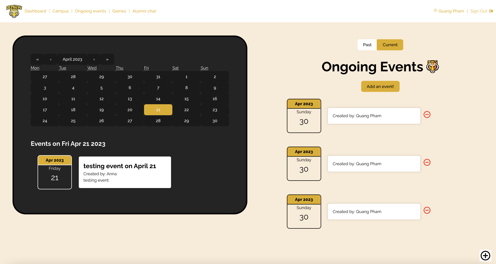

# CENTER FOR DIVERSITY AND INCLUSION PORTAL ([LIVE DEMO](https://cdi-portal.netlify.app/))

[](https://forthebadge.com)
[](https://forthebadge.com)
[](https://forthebadge.com)

<br>
<b>The Center For Diversity and Inclusion (CDI) Portal</b> is a web project that allows DePauw students, alumni, and faculty members to connect and engage with each other in a variety of ways. The portal provides features such as user authentication, post and event creation, chat functionality, and games to make the school experience more diverse.
<br/>
<br/>
<br/>
<br><br/>


## Getting Started & Installation

Install all the necessary packages and library of the application:
```javascript
npm install
```

Then, hit
```javascript
npm run dev
```
and open your [localhost](http://localhost:5173/) to see the application

## User Authentication
Registration         |  Signing In
:-------------------------:|:-------------------------:
 |  

The CDI Portal provides a robust user authentication system that only allows DePauw students to sign up for a new account or sign in with an existing one. This system ensures that only authorized users can access the portal's features and content. Make sure your password is strong enough!

## Posts and Events
Dashboard           |  Past/ Ongoing Events
:-------------------------:|:-------------------------:
 |  


The Portal allows users to create and share posts and events with the entire school community. 
Users can add details such as content, date, and time to their events. Events can be sorted in past and future. Posts can be sorted by popularity or newest order.

## Chat with Alumni
<br>
The Portal also provides a chat functionality that allows students to connect and engage with alumni and other students of the DePauw. This feature is a great way to build relationships, expand networking and learn from those who have gone before.

## Games

### Flashcard Game
<br><br/>

### Trivia Game
<br>

The Portal two games are designed to make the school experience more diverse and engaging. These games are fun and educational, and they provide a great way to relax and unwind after a long day of classes.

## Contributing

We welcome pull requests for this project. However, if you plan on making major changes, please start by opening an issue so we can discuss the changes beforehand. It is also important to ensure that any necessary tests are updated alongside any code changes.

## License

    Copyright [2023] [Thao Nguyen]

    Contributors: Quang Pham and Pushpita Saha.
    
    All rights reserved. This project is open for contributions from anyone who wishes to improve it.
    We welcome bug reports, feature requests, and pull requests on our GitHub repository. 
    By contributing to this project, you agree to release your contributions under the same license as 
    the project. Thank you for helping to make this project better!

